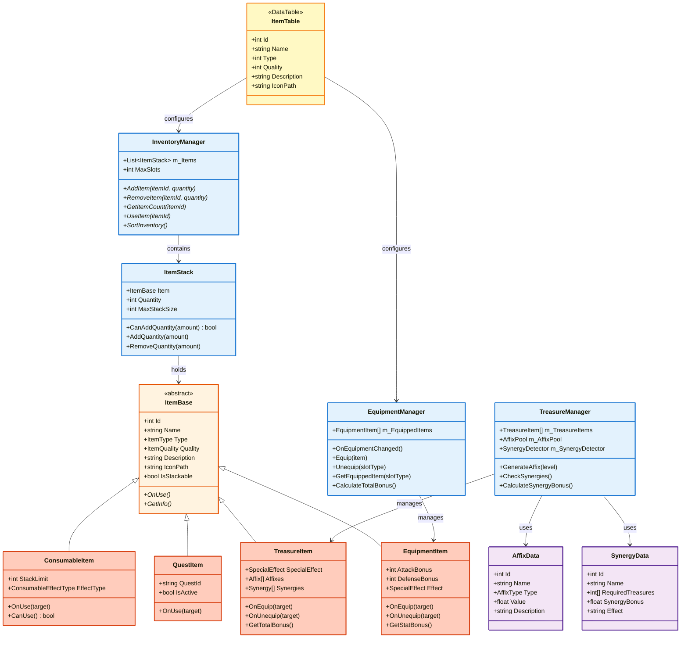

# 物品系统类图

```mermaid
---
config:
    classDiagram:
        nodeSpacing: 60
        rankSpacing: 80
        curve: linear
---
classDiagram
    class ItemBase {
        <<abstract>>
        +int Id
        +string Name
        +ItemType Type
        +ItemQuality Quality
        +string Description
        +string IconPath
        +bool IsStackable
        +OnUse()*
        +GetInfo()*
    }
    
    class ConsumableItem {
        +int StackLimit
        +ConsumableEffectType EffectType
        +OnUse(target)
        +CanUse() bool
    }
    
    class QuestItem {
        +string QuestId
        +bool IsActive
        +OnUse(target)
    }
    
    class TreasureItem {
        +SpecialEffect SpecialEffect
        +Affix[] Affixes
        +Synergy[] Synergies
        +OnEquip(target)
        +OnUnequip(target)
        +GetTotalBonus()
    }
    
    class EquipmentItem {
        +int AttackBonus
        +int DefenseBonus
        +SpecialEffect Effect
        +OnEquip(target)
        +OnUnequip(target)
        +GetStatBonus()
    }
    
    class InventoryManager {
        +List~ItemStack~ m_Items
        +int MaxSlots
        +AddItem(itemId, quantity)*
        +RemoveItem(itemId, quantity)*
        +GetItemCount(itemId)*
        +UseItem(itemId)*
        +SortInventory()*
    }
    
    class ItemStack {
        +ItemBase Item
        +int Quantity
        +int MaxStackSize
        +CanAddQuantity(amount) bool
        +AddQuantity(amount)
        +RemoveQuantity(amount)
    }
    
    class EquipmentManager {
        +EquipmentItem[] m_EquippedItems
        +OnEquipmentChanged()
        +Equip(item)
        +Unequip(slotType)
        +GetEquippedItem(slotType)
        +CalculateTotalBonus()
    }
    
    class TreasureManager {
        +TreasureItem[] m_TreasureItems
        +AffixPool m_AffixPool
        +SynergyDetector m_SynergyDetector
        +GenerateAffix(level)
        +CheckSynergies()
        +CalculateSynergyBonus()
    }
    
    class AffixData {
        +int Id
        +string Name
        +AffixType Type
        +float Value
        +string Description
    }
    
    class SynergyData {
        +int Id
        +string Name
        +int[] RequiredTreasures
        +float SynergyBonus
        +string Effect
    }
    
    class ItemTable {
        <<DataTable>>
        +int Id
        +string Name
        +int Type
        +int Quality
        +string Description
        +string IconPath
    }
    
    ItemBase <|-- ConsumableItem
    ItemBase <|-- QuestItem
    ItemBase <|-- TreasureItem
    ItemBase <|-- EquipmentItem
    
    InventoryManager --> ItemStack: contains
    ItemStack --> ItemBase: holds
    
    EquipmentManager --> EquipmentItem: manages
    TreasureManager --> TreasureItem: manages
    TreasureManager --> AffixData: uses
    TreasureManager --> SynergyData: uses
    
    ItemTable --> InventoryManager: configures
    ItemTable --> EquipmentManager: configures
    
    style ItemBase fill:#fff3e0,stroke:#e65100,stroke-width:2px
    style ConsumableItem fill:#ffccbc,stroke:#d84315,stroke-width:2px
    style QuestItem fill:#ffccbc,stroke:#d84315,stroke-width:2px
    style TreasureItem fill:#ffccbc,stroke:#d84315,stroke-width:2px
    style EquipmentItem fill:#ffccbc,stroke:#d84315,stroke-width:2px
    style InventoryManager fill:#e3f2fd,stroke:#1976d2,stroke-width:2px
    style ItemStack fill:#e3f2fd,stroke:#1976d2,stroke-width:2px
    style EquipmentManager fill:#e3f2fd,stroke:#1976d2,stroke-width:2px
    style TreasureManager fill:#e3f2fd,stroke:#1976d2,stroke-width:2px
    style AffixData fill:#f3e5f5,stroke:#4a148c,stroke-width:2px
    style SynergyData fill:#f3e5f5,stroke:#4a148c,stroke-width:2px
    style ItemTable fill:#fff9c4,stroke:#f57f17,stroke-width:2px
```
