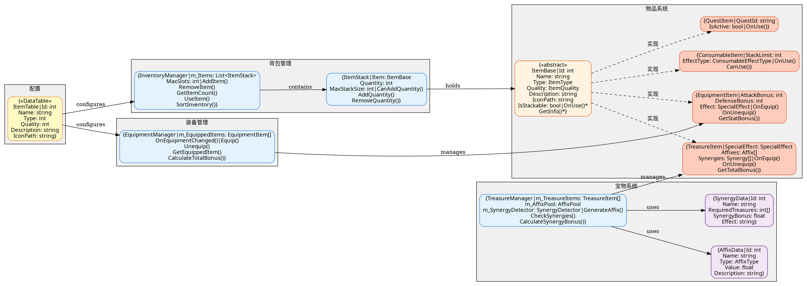

# 物品系统类图

```dot
// 物品系统类图 - Graphviz DOT格式
// 强制正交线条，从左到右显示类关系
digraph ItemSystemClassDiagram {
    graph [
        rankdir=LR
        splines=orthogonal
        nodesep=0.7
        ranksep=1.0
        fontname="SimHei,sans-serif"
    ]
    
    node [shape=box, style="filled,rounded", fontname="SimHei,sans-serif"]
    
    // 物品基类
    subgraph cluster_item {
        label="物品系统"
        style=filled
        fillcolor="#f0f0f0"
        
        ItemBase [label="{«abstract»\nItemBase|Id: int\nName: string\nType: ItemType\nQuality: ItemQuality\nDescription: string\nIconPath: string\nIsStackable: bool|OnUse()*\nGetInfo()*}", fillcolor="#fff3e0", color="#e65100"]
        ConsumableItem [label="{ConsumableItem|StackLimit: int\nEffectType: ConsumableEffectType|OnUse()\nCanUse()}", fillcolor="#ffccbc", color="#d84315"]
        QuestItem [label="{QuestItem|QuestId: string\nIsActive: bool|OnUse()}", fillcolor="#ffccbc", color="#d84315"]
        TreasureItem [label="{TreasureItem|SpecialEffect: SpecialEffect\nAffixes: Affix[]\nSynergies: Synergy[]|OnEquip()\nOnUnequip()\nGetTotalBonus()}", fillcolor="#ffccbc", color="#d84315"]
        EquipmentItem [label="{EquipmentItem|AttackBonus: int\nDefenseBonus: int\nEffect: SpecialEffect|OnEquip()\nOnUnequip()\nGetStatBonus()}", fillcolor="#ffccbc", color="#d84315"]
    }
    
    // 背包管理
    subgraph cluster_inventory {
        label="背包管理"
        style=filled
        fillcolor="#f0f0f0"
        
        InventoryManager [label="{InventoryManager|m_Items: List\<ItemStack\>\nMaxSlots: int|AddItem()\nRemoveItem()\nGetItemCount()\nUseItem()\nSortInventory()}", fillcolor="#e3f2fd", color="#1976d2"]
        ItemStack [label="{ItemStack|Item: ItemBase\nQuantity: int\nMaxStackSize: int|CanAddQuantity()\nAddQuantity()\nRemoveQuantity()}", fillcolor="#e3f2fd", color="#1976d2"]
    }
    
    // 装备管理
    subgraph cluster_equipment {
        label="装备管理"
        style=filled
        fillcolor="#f0f0f0"
        
        EquipmentManager [label="{EquipmentManager|m_EquippedItems: EquipmentItem[]\nOnEquipmentChanged()|Equip()\nUnequip()\nGetEquippedItem()\nCalculateTotalBonus()}", fillcolor="#e3f2fd", color="#1976d2"]
    }
    
    // 宝物系统
    subgraph cluster_treasure {
        label="宝物系统"
        style=filled
        fillcolor="#f0f0f0"
        
        TreasureManager [label="{TreasureManager|m_TreasureItems: TreasureItem[]\nm_AffixPool: AffixPool\nm_SynergyDetector: SynergyDetector|GenerateAffix()\nCheckSynergies()\nCalculateSynergyBonus()}", fillcolor="#e3f2fd", color="#1976d2"]
        AffixData [label="{AffixData|Id: int\nName: string\nType: AffixType\nValue: float\nDescription: string}", fillcolor="#f3e5f5", color="#4a148c"]
        SynergyData [label="{SynergyData|Id: int\nName: string\nRequiredTreasures: int[]\nSynergyBonus: float\nEffect: string}", fillcolor="#f3e5f5", color="#4a148c"]
    }
    
    // 配置表
    subgraph cluster_config {
        label="配置"
        style=filled
        fillcolor="#f0f0f0"
        
        ItemTable [label="{«DataTable»\nItemTable|Id: int\nName: string\nType: int\nQuality: int\nDescription: string\nIconPath: string}", fillcolor="#fff9c4", color="#f57f17"]
    }
    
    // 继承关系
    ItemBase -> ConsumableItem [label="实现", style=dashed]
    ItemBase -> QuestItem [label="实现", style=dashed]
    ItemBase -> TreasureItem [label="实现", style=dashed]
    ItemBase -> EquipmentItem [label="实现", style=dashed]
    
    // 包含关系
    InventoryManager -> ItemStack [label="contains"]
    ItemStack -> ItemBase [label="holds"]
    
    // 管理关系
    EquipmentManager -> EquipmentItem [label="manages"]
    TreasureManager -> TreasureItem [label="manages"]
    TreasureManager -> AffixData [label="uses"]
    TreasureManager -> SynergyData [label="uses"]
    
    // 配置关系
    ItemTable -> InventoryManager [label="configures"]
    ItemTable -> EquipmentManager [label="configures"]
}
```
