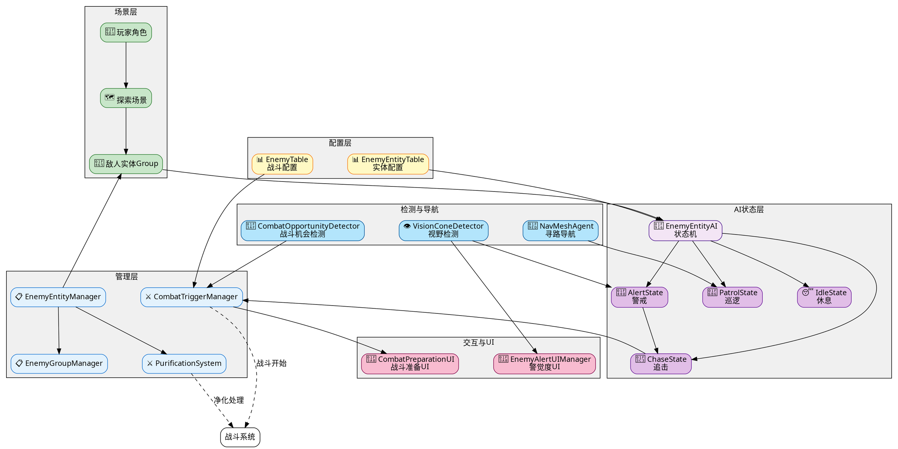

# 探索系统架构图

```dot
// 探索系统架构图 - Graphviz DOT格式
// 强制正交线条，优化空间利用率
digraph ExplorationArchitecture {
    graph [
        rankdir=TB
        splines=orthogonal
        nodesep=0.9
        ranksep=1.2
        fontname="SimHei,sans-serif"
    ]
    
    node [shape=box, style="filled,rounded", fontname="SimHei,sans-serif"]
    
    // 场景层
    subgraph cluster_scene {
        label="场景层"
        style=filled
        fillcolor="#f0f0f0"
        
        A [label="🗺️ 探索场景", fillcolor="#c8e6c9", color="#2e7d32"]
        B [label="👥 敌人实体Group", fillcolor="#c8e6c9", color="#2e7d32"]
        C [label="🧑 玩家角色", fillcolor="#c8e6c9", color="#2e7d32"]
    }
    
    // 管理层
    subgraph cluster_manage {
        label="管理层"
        style=filled
        fillcolor="#f0f0f0"
        
        D [label="📋 EnemyEntityManager", fillcolor="#e3f2fd", color="#1976d2"]
        E [label="📋 EnemyGroupManager", fillcolor="#e3f2fd", color="#1976d2"]
        F [label="⚔️ PurificationSystem", fillcolor="#e3f2fd", color="#1976d2"]
        G [label="⚔️ CombatTriggerManager", fillcolor="#e3f2fd", color="#1976d2"]
    }
    
    // AI状态层
    subgraph cluster_ai {
        label="AI状态层"
        style=filled
        fillcolor="#f0f0f0"
        
        H [label="🤖 EnemyEntityAI\n状态机", fillcolor="#f3e5f5", color="#4a148c"]
        I [label="😴 IdleState\n休息", fillcolor="#e1bee7", color="#6a1b9a"]
        J [label="🚶 PatrolState\n巡逻", fillcolor="#e1bee7", color="#6a1b9a"]
        K [label="👀 AlertState\n警戒", fillcolor="#e1bee7", color="#6a1b9a"]
        L [label="🏃 ChaseState\n追击", fillcolor="#e1bee7", color="#6a1b9a"]
    }
    
    // 检测与导航
    subgraph cluster_detect {
        label="检测与导航"
        style=filled
        fillcolor="#f0f0f0"
        
        M [label="👁️ VisionConeDetector\n视野检测", fillcolor="#b3e5fc", color="#01579b"]
        N [label="🎯 CombatOpportunityDetector\n战斗机会检测", fillcolor="#b3e5fc", color="#01579b"]
        O [label="🧭 NavMeshAgent\n寻路导航", fillcolor="#b3e5fc", color="#01579b"]
    }
    
    // 配置层
    subgraph cluster_config {
        label="配置层"
        style=filled
        fillcolor="#f0f0f0"
        
        P [label="📊 EnemyEntityTable\n实体配置", fillcolor="#fff9c4", color="#f57f17"]
        Q [label="📊 EnemyTable\n战斗配置", fillcolor="#fff9c4", color="#f57f17"]
    }
    
    // 交互与UI
    subgraph cluster_ui {
        label="交互与UI"
        style=filled
        fillcolor="#f0f0f0"
        
        R [label="🎨 EnemyAlertUIManager\n警觉度UI", fillcolor="#f8bbd0", color="#880e4f"]
        S [label="🎨 CombatPreparationUI\n战斗准备UI", fillcolor="#f8bbd0", color="#880e4f"]
    }
    
    // 边关系
    A -> B
    B -> H
    C -> A
    
    D -> B
    D -> E
    D -> F
    
    M -> K
    N -> G
    O -> J
    
    H -> I
    H -> J
    H -> K
    H -> L
    
    M -> R
    G -> S
    
    K -> L
    L -> G
    
    P -> H
    Q -> G
    
    G -> CombatSystem [style=dashed, label="战斗开始"]
    F -> CombatSystem [style=dashed, label="净化处理"]
    
    CombatSystem [label="战斗系统", shape=box, fillcolor="white"]
}
```
