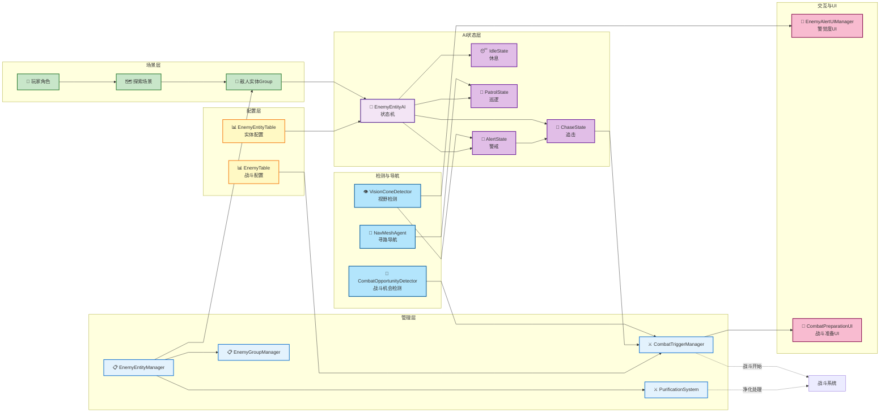

# 探索系统架构图

```mermaid
---
config:
    flowchart:
        nodeSpacing: 60
        rankSpacing: 100
        curve: linear
---
flowchart LR
    subgraph "场景层"
        A["🗺️ 探索场景"]
        B["👥 敌人实体Group"]
        C["🧑 玩家角色"]
    end
    
    subgraph "管理层"
        D["📋 EnemyEntityManager"]
        E["📋 EnemyGroupManager"]
        F["⚔️ PurificationSystem"]
        G["⚔️ CombatTriggerManager"]
    end
    
    subgraph "AI状态层"
        H["🤖 EnemyEntityAI<br/>状态机"]
        I["😴 IdleState<br/>休息"]
        J["🚶 PatrolState<br/>巡逻"]
        K["👀 AlertState<br/>警戒"]
        L["🏃 ChaseState<br/>追击"]
    end
    
    subgraph "检测与导航"
        M["👁️ VisionConeDetector<br/>视野检测"]
        N["🎯 CombatOpportunityDetector<br/>战斗机会检测"]
        O["🧭 NavMeshAgent<br/>寻路导航"]
    end
    
    subgraph "配置层"
        P["📊 EnemyEntityTable<br/>实体配置"]
        Q["📊 EnemyTable<br/>战斗配置"]
    end
    
    subgraph "交互与UI"
        R["🎨 EnemyAlertUIManager<br/>警觉度UI"]
        S["🎨 CombatPreparationUI<br/>战斗准备UI"]
    end
    
    A --> B
    B --> H
    C --> A
    
    D --> B
    D --> E
    D --> F
    
    M --> K
    N --> G
    O --> J
    
    H --> I
    H --> J
    H --> K
    H --> L
    
    M --> R
    G --> S
    
    K --> L
    L --> G
    
    P --> H
    Q --> G
    
    G -.->|战斗开始| 战斗系统
    F -.->|净化处理| 战斗系统
    
    style A fill:#c8e6c9,stroke:#2e7d32,stroke-width:2px
    style B fill:#c8e6c9,stroke:#2e7d32,stroke-width:2px
    style C fill:#c8e6c9,stroke:#2e7d32,stroke-width:2px
    
    style D fill:#e3f2fd,stroke:#1976d2,stroke-width:2px
    style E fill:#e3f2fd,stroke:#1976d2,stroke-width:2px
    style F fill:#e3f2fd,stroke:#1976d2,stroke-width:2px
    style G fill:#e3f2fd,stroke:#1976d2,stroke-width:2px
    
    style H fill:#f3e5f5,stroke:#4a148c,stroke-width:2px
    style I fill:#e1bee7,stroke:#6a1b9a,stroke-width:2px
    style J fill:#e1bee7,stroke:#6a1b9a,stroke-width:2px
    style K fill:#e1bee7,stroke:#6a1b9a,stroke-width:2px
    style L fill:#e1bee7,stroke:#6a1b9a,stroke-width:2px
    
    style M fill:#b3e5fc,stroke:#01579b,stroke-width:2px
    style N fill:#b3e5fc,stroke:#01579b,stroke-width:2px
    style O fill:#b3e5fc,stroke:#01579b,stroke-width:2px
    
    style P fill:#fff9c4,stroke:#f57f17,stroke-width:2px
    style Q fill:#fff9c4,stroke:#f57f17,stroke-width:2px
    
    style R fill:#f8bbd0,stroke:#880e4f,stroke-width:2px
    style S fill:#f8bbd0,stroke:#880e4f,stroke-width:2px
```
