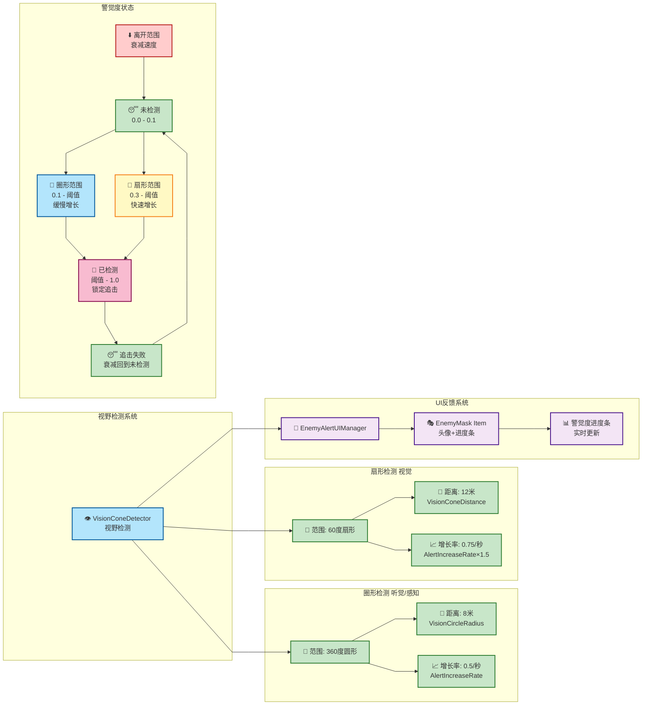

# 视野检测示意图

```mermaid
---
config:
    flowchart:
        nodeSpacing: 50
        rankSpacing: 80
        curve: linear
---
flowchart LR
    subgraph "视野检测系统"
        A["👁️ VisionConeDetector<br/>视野检测"]
    end
    
    subgraph "圈形检测 听觉/感知"
        B["🔵 范围: 360度圆形"]
        C["📏 距离: 8米<br/>VisionCircleRadius"]
        D["📈 增长率: 0.5/秒<br/>AlertIncreaseRate"]
    end
    
    subgraph "扇形检测 视觉"
        E["🔶 范围: 60度扇形"]
        F["📏 距离: 12米<br/>VisionConeDistance"]
        G["📈 增长率: 0.75/秒<br/>AlertIncreaseRate×1.5"]
    end
    
    subgraph "警觉度状态"
        H["⬇️ 离开范围<br/>衰减速度"]
        I["😴 未检测<br/>0.0 - 0.1"]
        J["👀 圈形范围<br/>0.1 - 阈值<br/>缓慢增长"]
        K["🎯 扇形范围<br/>0.3 - 阈值<br/>快速增长"]
        L["🚨 已检测<br/>阈值 - 1.0<br/>锁定追击"]
        M["😴 追击失败<br/>衰减回到未检测"]
    end
    
    subgraph "UI反馈系统"
        N["🎨 EnemyAlertUIManager"]
        O["🎭 EnemyMask Item<br/>头像+进度条"]
        P["📊 警觉度进度条<br/>实时更新"]
    end
    
    A --> B
    A --> E
    B --> C
    B --> D
    E --> F
    E --> G
    
    H --> I
    I --> J
    I --> K
    J --> L
    K --> L
    L --> M
    M --> I
    
    A --> N
    N --> O
    O --> P
    
    style A fill:#b3e5fc,stroke:#01579b,stroke-width:2px
    
    style B fill:#c8e6c9,stroke:#2e7d32,stroke-width:2px
    style C fill:#c8e6c9,stroke:#2e7d32,stroke-width:2px
    style D fill:#c8e6c9,stroke:#2e7d32,stroke-width:2px
    
    style E fill:#c8e6c9,stroke:#2e7d32,stroke-width:2px
    style F fill:#c8e6c9,stroke:#2e7d32,stroke-width:2px
    style G fill:#c8e6c9,stroke:#2e7d32,stroke-width:2px
    
    style H fill:#ffcccc,stroke:#b71c1c,stroke-width:2px
    style I fill:#c8e6c9,stroke:#2e7d32,stroke-width:2px
    style J fill:#b3e5fc,stroke:#01579b,stroke-width:2px
    style K fill:#fff9c4,stroke:#f57f17,stroke-width:2px
    style L fill:#f8bbd0,stroke:#880e4f,stroke-width:2px
    style M fill:#c8e6c9,stroke:#2e7d32,stroke-width:2px
    
    style N fill:#f3e5f5,stroke:#4a148c,stroke-width:2px
    style O fill:#f3e5f5,stroke:#4a148c,stroke-width:2px
    style P fill:#f3e5f5,stroke:#4a148c,stroke-width:2px
```
