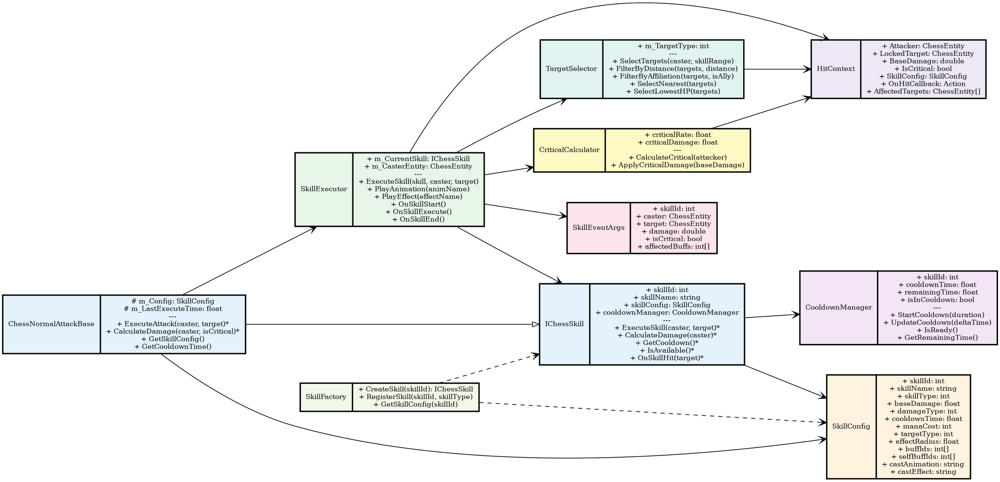

# 图4-11 技能系统类图（详细设计）



## 类设计说明

### 核心接口与基类

**IChessSkill** (技能接口)
- 所有技能的统一接口
- 包含技能执行、伤害计算、冷却管理
- 支持多态实现不同技能类型

**ChessNormalAttackBase** (普攻基类)
- 继承IChessSkill接口
- 实现普通攻击的通用逻辑
- 具体职业技能继承此类重写方法

### 配置与管理

**SkillConfig** (技能配置)
- 来自SkillTable（Excel配置表）
- 包含所有技能参数
- 数据驱动设计，支持策划配置

**CooldownManager** (冷却管理)
- 管理技能的冷却时间
- 支持冷却重置、缩短等Buff效果
- 实现IUpdatable接口定时更新

**SkillFactory** (技能工厂)
- 通过ID创建技能实例
- 注册技能类型映射
- 支持动态扩展新技能

### 执行与计算

**SkillExecutor** (技能执行器)
- 执行技能的主要逻辑
- 协调动画、特效、伤害、Buff
- 按照时序触发各阶段事件

**TargetSelector** (目标选择)
- 根据SkillConfig.targetType选择目标
- 支持单体、范围、随机等选择方式
- 集成距离、生命值等过滤逻辑

**CriticalCalculator** (暴击计算)
- 根据攻击者属性计算暴击率
- 计算暴击伤害倍数
- 支持Buff修正暴击概率

**HitContext** (命中上下文)
- 包含命中检测所需的所有信息
- 传递给HitDetector执行检测
- 支持回调机制实现自定义逻辑

### 事件系统

**SkillEventArgs** (技能事件参数)
- 发布技能执行事件
- 包含伤害、暴击等结果信息
- UI系统订阅此事件更新显示

## 技能执行流程

```
技能触发（ChessAI.Attack）
    ↓
SkillExecutor.ExecuteSkill(skill, caster, target)
    ├─ 检查冷却（CooldownManager.IsReady）
    ├─ 播放动画（SkillExecutor.PlayAnimation）
    ├─ 选择目标（TargetSelector.SelectTargets）
    ├─ 计算暴击（CriticalCalculator.CalculateCritical）
    ├─ 构建HitContext
    ├─ 执行命中检测（HitDetector.Execute）
    ├─ 应用伤害
    ├─ 应用Buff（BuffManager.ApplyBuffsOnHit）
    ├─ 触发回调（context.OnHitCallback）
    └─ 发布事件（SkillEventArgs）

冷却管理
    ├─ 技能执行时调用CooldownManager.StartCooldown
    ├─ 每帧调用UpdateCooldown更新计时
    ├─ Buff可修改冷却时间
    └─ 冷却完成时变为可用
```

## 关键设计特点

1. **多态技能系统**: 通过IChessSkill接口支持不同职业的技能实现
2. **配置驱动**: 技能参数全部来自配置表，支持热更新
3. **时序控制**: 通过事件和动画事件精确控制技能执行时机
4. **冷却管理**: 独立的冷却管理器，支持Buff修正
5. **目标选择**: 灵活的目标选择机制，支持多种选择策略
6. **暴击系统**: 独立的暴击计算，支持属性和Buff影响
7. **事件驱动**: 发布技能事件，与UI和其他系统解耦

## 扩展建议

- 新增技能职业：继承ChessNormalAttackBase，重写ExecuteSkill
- 新增技能效果：在SkillEventArgs中添加字段，UI订阅事件处理
- 新增目标选择：在TargetSelector中添加新的选择方法
- 新增冷却修正：Buff可通过event修改CooldownManager的冷却时间
