# 图4-17 背包管理系统类图

```dot
digraph InventorySystem {
    rankdir=LR;
    nodesep=0.6;
    ranksep=1.0;
    splines=orthogonal;
    
    node [shape=box, style=filled, fontsize=9];
    edge [arrowhead=vee];
    
    InventoryManager [label="{InventoryManager|- m_Items: ItemStack[]\n- m_MaxSlots: int\n- m_TotalWeight: float\n- m_MaxWeight: float\n---\n+ AddItem(itemId, quantity): bool\n+ RemoveItem(itemId, quantity): bool\n+ UseItem(itemId): bool\n+ GetItem(itemId): ItemStack\n+ SortInventory()\n+ OnInventoryChanged()}", shape=record, fillcolor="#e3f2fd", stroke="#1976d2", penwidth=2];
    
    ItemStack [label="{ItemStack|- m_Item: ItemBase\n- m_Quantity: int\n- m_MaxStackSize: int\n---\n+ Item: ItemBase\n+ Quantity: int\n+ CanAddQuantity(amount): bool\n+ AddQuantity(amount)\n+ RemoveQuantity(amount)\n+ IsFull(): bool}", shape=record, fillcolor="#e3f2fd", stroke="#1976d2", penwidth=2];
    
    InventorySlot [label="{InventorySlot|- m_SlotIndex: int\n- m_SlotType: int\n- m_ItemStack: ItemStack\n- m_IsEmpty: bool\n---\n+ SetItemStack(itemStack)\n+ GetItemStack(): ItemStack\n+ ClearSlot()\n+ IsValidForItem(itemId): bool\n+ GetSlotWeight()}", shape=record, fillcolor="#e3f2fd", stroke="#1976d2", penwidth=2];
    
    ItemBase [label="{ItemBase|+ itemId: int\n+ itemName: string\n+ itemType: int\n+ quality: int\n+ weight: float\n+ maxStackSize: int\n+ description: string\n+ iconPath: string\n---\n+ GetDisplayName(): string\n+ GetDescription(): string\n+ CanBeUsed(): bool}", shape=record, fillcolor="#fff3e0", stroke="#e65100", penwidth=2];
    
    ConsumableItem [label="{ConsumableItem|- effectType: int\n- effectValue: float\n- usageCount: int\n- maxUsage: int\n---\n+ CanBeUsed(): bool\n+ UseItem(target)\n+ GetRemainingUsage()}", shape=record, fillcolor="#ffccbc", stroke="#d84315", penwidth=2];
    
    QuestItem [label="{QuestItem|- questId: string\n- isActive: bool\n---\n+ CanBeUsed(): bool\n+ OnItemUsed()\n+ LinkToQuest(questId)}", shape=record, fillcolor="#ffccbc", stroke="#d84315", penwidth=2];
    
    TreasureItem [label="{TreasureItem|- specialEffect: SpecialEffect\n- affixes: Affix[]\n- synergies: Synergy[]\n- rarity: int\n---\n+ CanBeEquipped(): bool\n+ GetTotalBonus()\n+ CanStack(): bool}", shape=record, fillcolor="#ffccbc", stroke="#d84315", penwidth=2];
    
    EquipmentItem [label="{EquipmentItem|- equipmentType: int\n- attackBonus: int\n- defenseBonus: int\n- specialEffect: SpecialEffect\n---\n+ CanBeEquipped(): bool\n+ CanStack(): bool\n+ GetStatBonus(): Dictionary}", shape=record, fillcolor="#ffccbc", stroke="#d84315", penwidth=2];
    
    BackpackConfig [label="{BackpackConfig|+ maxSlots: int\n+ maxWeight: float\n+ slotTypes: int[]\n+ sortMethod: int\n+ autoStackItems: bool\n+ ignoreWeightLimit: bool}", shape=record, fillcolor="#f3e5f5", stroke="#4a148c", penwidth=2];
    
    InventoryUI [label="{InventoryUI|- m_Manager: InventoryManager\n- m_SlotUIList: InventorySlotUI[]\n- m_CurrentSort: int\n---\n+ DisplayInventory()\n+ RefreshDisplay()\n+ OnItemSelected(slotIndex)\n+ OnItemDrop(fromSlot, toSlot)\n+ ShowItemDetail(itemId)}", shape=record, fillcolor="#e8f5e9", stroke="#1b5e20", penwidth=2];
    
    InventorySlotUI [label="{InventorySlotUI|- m_SlotIndex: int\n- m_ItemStack: ItemStack\n- m_Icon: Image\n- m_QuantityText: Text\n- m_IsSelected: bool\n---\n+ SetItemStack(itemStack)\n+ OnClicked()\n+ OnDragStart()\n+ OnDragEnd(targetSlot)\n+ ShowTooltip()}", shape=record, fillcolor="#c8e6c9", stroke="#2e7d32", penwidth=2];
    
    ItemFilter [label="{ItemFilter|- filterType: int\n- filterQuality: int\n- filterWeight: float\n---\n+ Filter(items): ItemStack[]\n+ FilterByType(items, type)\n+ FilterByQuality(items, quality)\n+ FilterByWeight(items, maxWeight)}", shape=record, fillcolor="#f1f8e9", stroke="#558b2f", penwidth=2];
    
    InventorySerializer [label="{InventorySerializer|+ SaveInventory(manager, path)\n+ LoadInventory(path): InventoryManager\n+ SerializeItemStack(itemStack)\n+ DeserializeItemStack(data)}", shape=record, fillcolor="#e0f2f1", stroke="#00695c", penwidth=2];
    
    BackpackSorter [label="{BackpackSorter|- sortMethod: int\n---\n+ SortByType(items)\n+ SortByQuality(items)\n+ SortByWeight(items)\n+ SortByName(items)\n+ SortByObtainTime(items)}", shape=record, fillcolor="#fff9c4", stroke="#f57f17", penwidth=2];
    
    InventoryEventArgs [label="{InventoryEventArgs|+ itemId: int\n+ quantity: int\n+ slotIndex: int\n+ eventType: int}", shape=record, fillcolor="#fce4ec", stroke="#c2185b", penwidth=2];
    
    InventoryManager -> ItemStack;
    InventoryManager -> InventorySlot;
    InventoryManager -> BackpackConfig;
    InventoryManager -> ItemFilter;
    InventoryManager -> BackpackSorter;
    InventoryManager -> InventorySerializer;
    InventoryManager -> InventoryEventArgs [style=dashed];
    
    ItemStack -> ItemBase;
    InventorySlot -> ItemStack;
    
    ConsumableItem -> ItemBase [arrowhead=empty];
    QuestItem -> ItemBase [arrowhead=empty];
    TreasureItem -> ItemBase [arrowhead=empty];
    EquipmentItem -> ItemBase [arrowhead=empty];
    
    InventoryUI -> InventoryManager;
    InventoryUI -> InventorySlotUI;
    InventoryUI -> ItemFilter;
    
    InventorySlotUI -> ItemStack;
    InventorySlotUI -> InventoryEventArgs;
    
    BackpackSorter -> ItemStack;
    ItemFilter -> ItemBase;
}
```



## 系统设计说明

### 核心类说明

**InventoryManager** (背包管理器)
- 中心管理类，负责背包的所有操作
- 维护ItemStack数组和配置信息
- 处理物品增删改查
- 发布物品变化事件

**ItemStack** (物品堆叠)
- 表示背包中的一个物品条目
- 支持堆叠和数量管理
- 检查堆叠上限
- 物品和数量的统一封装

**InventorySlot** (背包格子)
- 表示背包中的一个格子
- 包含格子编号和类型限制
- 支持物品放置和取出
- 可配置格子限制（仅装备、仅消耗品等）

**ItemBase** (物品基类)
- 所有物品的抽象基类
- 定义物品的共同属性（ID、名称、重量等）
- 支持多态以实现不同物品类型
- 提供虚方法供子类重写

**物品分类**:
- ConsumableItem：可消耗品
- QuestItem：任务道具
- TreasureItem：宝物
- EquipmentItem：装备

### 配置与工具

**BackpackConfig** (背包配置)
- 来自配置表的背包参数
- 支持多种背包大小和限制
- 支持自定义排序和堆叠规则
- 支持忽略重量限制

**ItemFilter** (物品过滤)
- 按类型、品质、重量等过滤
- 支持组合过滤
- 用于快速查找物品
- 返回过滤后的ItemStack列表

**BackpackSorter** (背包排序)
- 按多种维度排序物品
- 支持按类型、品质、重量、名称等排序
- 支持自定义排序规则
- 提升用户体验

**InventorySerializer** (背包序列化)
- 保存和加载背包数据
- 支持JSON/Binary格式
- 用于游戏存档

### UI层

**InventoryUI** (背包界面)
- 背包主界面
- 显示所有格子和物品
- 处理物品选择和详情显示
- 响应物品变化事件

**InventorySlotUI** (格子UI)
- 单个格子的UI表现
- 显示物品图标和数量
- 支持拖拽和右键菜单
- 显示物品Tooltip

### 事件系统

**InventoryEventArgs** (背包事件参数)
- 发布物品增加、减少、使用事件
- 包含物品ID、数量、格子位置等信息
- UI系统订阅此事件更新显示
- 其他系统订阅以响应背包变化

## 关键功能流程

### 添加物品流程
```
AddItem(itemId, quantity)
    ├─ 检查物品是否存在
    ├─ 检查是否超过最大重量
    ├─ 查找已有相同物品的格子
    │   ├─ 如果找到且可堆叠
    │   │   └─ 向现有格子添加数量
    │   └─ 如果未找到或不可堆叠
    │       └─ 找空格子创建新ItemStack
    ├─ 更新背包总重量
    ├─ 发布ItemAddedEvent事件
    └─ 返回是否成功

UI订阅事件 → 刷新显示
```

### 使用物品流程
```
UseItem(itemId)
    ├─ 查找物品
    ├─ 检查物品是否可使用
    ├─ 执行物品效果
    ├─ 减少物品数量或删除
    ├─ 发布ItemUsedEvent事件
    └─ 返回使用结果

UI订阅事件 → 显示效果反馈
```

### 拖拽交互流程
```
OnDragStart(fromSlot)
    ├─ 保存源格子信息
    ├─ 显示拖拽预览
    └─ 发布DragStartEvent

OnDragEnd(toSlot)
    ├─ 验证目标格子有效性
    ├─ 执行物品移动或交换
    ├─ 更新UI显示
    └─ 发布InventoryChangedEvent
```

## 关键设计特点

1. **模块化设计**: 各类职责清晰，易于维护和扩展
2. **事件驱动**: 通过事件通知UI和其他系统
3. **配置驱动**: 背包参数全部可配置
4. **多物品类型**: 支持消耗品、任务道具、宝物、装备等
5. **堆叠系统**: 智能管理物品堆叠
6. **过滤排序**: 提供快速查找和整理功能
7. **序列化支持**: 支持游戏存档

## 扩展建议

- 新增背包扩展功能（金币购买扩容）
- 新增物品分类收藏功能
- 新增物品锁定防止误删
- 新增物品快捷栏系统
- 新增背包快速整理（一键堆叠）
- 新增物品搜索功能（模糊查询）
