# 图4-22 卡牌系统类图

```dot
digraph CardSystem {
    rankdir=LR;
    nodesep=0.6;
    ranksep=1.0;
    splines=orthogonal;
    
    node [shape=box, style=filled, fontsize=9];
    edge [arrowhead=vee];
    
    CardManager [label="{CardManager|- m_CardPool: CardPool\n- m_HandCards: HandCards\n- m_CardFactory: CardFactory\n- m_CurrentSession: CardSession\n---\n+ ObtainCard(cardId)\n+ UseCard(cardId, target)\n+ DiscardCard(cardId)\n+ GetHandCards(): Card[]\n+ GetCardById(cardId): Card\n+ OnCardUsed()}", shape=record, fillcolor="#e3f2fd", stroke="#1976d2", penwidth=2];
    
    Card [label="{Card|+ cardId: int\n+ cardName: string\n+ cardType: int\n+ cost: int\n+ rarity: int\n+ description: string\n+ iconPath: string\n+ m_Effect: ICardEffect\n---\n+ GetEffectDescription(): string\n+ CanBeUsed(context): bool}", shape=record, fillcolor="#e3f2fd", stroke="#1976d2", penwidth=2];
    
    CardConfig [label="{CardConfig|+ cardId: int\n+ cardName: string\n+ cardType: int\n+ cardRarity: int\n+ effectType: int\n+ effectParams: int[]\n+ cost: int\n+ targetType: int\n+ triggerId: string\n+ description: string}", shape=record, fillcolor="#fff3e0", stroke="#e65100", penwidth=2];
    
    ICardEffect [label="{ICardEffect|+ effectId: int\n+ effectType: int\n---\n+ Execute(context)*\n+ CanTrigger(context)*: bool\n+ GetEffectTargets(context)*: ChessEntity[]}", shape=record, fillcolor="#e3f2fd", stroke="#1976d2", penwidth=2];
    
    CardEffectBase [label="{CardEffectBase|# m_EffectId: int\n# m_Config: CardConfig\n# m_Executor: EffectExecutor\n---\n+ Execute(context)\n# GetTargets(context)*: ChessEntity[]\n# ApplyEffect(target)\n# PlayEffect()}", shape=record, fillcolor="#e3f2fd", stroke="#1976d2", penwidth=2];
    
    AllyBuffCardEffect [label="{AllyBuffCardEffect|- buffIds: int[]\n- targetType: int\n---\n+ Execute(context)\n+ GetEffectTargets()}", shape=record, fillcolor="#bbdefb", stroke="#1565c0", penwidth=2];
    
    DamageCardEffect [label="{DamageCardEffect|- damageValue: float\n- damageType: int\n- areaRadius: float\n---\n+ Execute(context)\n+ CalculateDamage()\n+ GetEffectTargets()}", shape=record, fillcolor="#bbdefb", stroke="#1565c0", penwidth=2];
    
    ControlCardEffect [label="{ControlCardEffect|- controlType: int\n- duration: float\n---\n+ Execute(context)\n+ ApplyControl(target)}", shape=record, fillcolor="#bbdefb", stroke="#1565c0", penwidth=2];
    
    HealCardEffect [label="{HealCardEffect|- healValue: float\n- healType: int\n- targetType: int\n---\n+ Execute(context)\n+ CalculateHeal()\n+ GetEffectTargets()}", shape=record, fillcolor="#bbdefb", stroke="#1565c0", penwidth=2];
    
    CardPool [label="{CardPool|- m_Cards: Dictionary<int, Card[]>\n- m_PullCount: int\n- m_MaxCards: int\n---\n+ AddCard(cardId, count)\n+ RemoveCard(cardId, count)\n+ GetCardCount(cardId): int\n+ GetAllCards(): Card[]\n+ IsAvailable(cardId): bool}", shape=record, fillcolor="#e8f5e9", stroke="#1b5e20", penwidth=2];
    
    HandCards [label="{HandCards|- m_Cards: Card[]\n- m_MaxSlots: int\n- m_CurrentSlots: int\n---\n+ AddCard(card): bool\n+ RemoveCard(cardId): bool\n+ GetCards(): Card[]\n+ GetCardAt(slotIndex): Card\n+ IsFull(): bool\n+ IsEmpty(): bool}", shape=record, fillcolor="#e8f5e9", stroke="#1b5e20", penwidth=2];
    
    CardFactory [label="{CardFactory|+ CreateCard(cardId): Card\n+ CreateCardEffect(effectType): ICardEffect\n+ GetCardConfig(cardId)}", shape=record, fillcolor="#f1f8e9", stroke="#558b2f", penwidth=2];
    
    CardEventArgs [label="{CardEventArgs|+ cardId: int\n+ cardName: string\n+ targetEntity: ChessEntity\n+ effectType: int\n+ eventType: int\n+ timestamp: float}", shape=record, fillcolor="#fce4ec", stroke="#c2185b", penwidth=2];
    
    EffectExecutor [label="{EffectExecutor|+ ApplyCardEffect(card, target)\n+ PlayCardEffectAnimation(effectType, position)\n+ PlayCardEffectSound(cardId)\n+ ApplyBuffToTarget(buffIds, target, source)\n+ ApplyDamageToTarget(damage, target, source)}", shape=record, fillcolor="#f3e5f5", stroke="#4a148c", penwidth=2];
    
    CardSession [label="{CardSession|- m_SessionId: string\n- m_StartTime: float\n- m_UsedCards: Card[]\n- m_RemainingCards: HandCards\n---\n+ StartSession()\n+ UseCard(cardId)\n+ EndSession()\n+ GetSessionData()}", shape=record, fillcolor="#e0f2f1", stroke="#00695c", penwidth=2];
    
    CardUI [label="{CardUI|- m_CardManager: CardManager\n- m_HandCardsList: CardUIItem[]\n- m_CardDetailPanel: CardDetailPanel\n- m_CardAnimator: CardAnimator\n---\n+ DisplayHandCards()\n+ OnCardSelected(cardId)\n+ OnCardUsed(cardId)\n+ ShowCardDetail(cardId)\n+ PlayCardAnimation(cardId)}", shape=record, fillcolor="#fff9c4", stroke="#f57f17", penwidth=2];
    
    CardUIItem [label="{CardUIItem|- m_Card: Card\n- m_Icon: Image\n- m_CostText: Text\n- m_NameText: Text\n---\n+ SetCard(card)\n+ OnClicked()\n+ OnPointerEnter()\n+ OnPointerExit()\n+ ShowTooltip()}", shape=record, fillcolor="#fff9c4", stroke="#f57f17", penwidth=2];
    
    CardAnimator [label="{CardAnimator|+ PlayCardUsedAnimation(cardId, targetPos)\n+ PlayCardEffectAnimation(effectType)\n+ PlayCardRemovalAnimation(cardId)}", shape=record, fillcolor="#fff9c4", stroke="#f57f17", penwidth=2];
    
    CardPurification [label="{CardPurification|- sourceEnemy: ChessEntity\n- availableCards: CardId[]\n---\n+ SelectCard(cardId): Card\n+ ConfirmSelection()\n+ GetPurificationCards()}", shape=record, fillcolor="#ffccbc", stroke="#d84315", penwidth=2];
    
    CardManager -> CardPool;
    CardManager -> HandCards;
    CardManager -> CardFactory;
    CardManager -> CardSession;
    CardManager -> CardEventArgs [style=dashed];
    
    Card -> CardConfig;
    Card -> ICardEffect;
    
    CardFactory -> Card [style=dashed];
    CardFactory -> ICardEffect [style=dashed];
    
    CardEffectBase -> ICardEffect [arrowhead=empty];
    AllyBuffCardEffect -> CardEffectBase [arrowhead=empty];
    DamageCardEffect -> CardEffectBase [arrowhead=empty];
    ControlCardEffect -> CardEffectBase [arrowhead=empty];
    HealCardEffect -> CardEffectBase [arrowhead=empty];
    
    CardEffectBase -> EffectExecutor;
    CardEffectBase -> CardEventArgs;
    
    EffectExecutor -> CardEventArgs;
    
    HandCards -> Card;
    CardPool -> Card;
    
    CardUI -> CardManager;
    CardUI -> CardUIItem;
    CardUI -> CardAnimator;
    CardUI -> CardEventArgs;
    
    CardUIItem -> Card;
    
    CardPurification -> Card;
    CardPurification -> CardManager;
}
```



## 系统设计说明

### 核心类说明

**CardManager** (卡牌管理器)
- 卡牌系统的中心管理类
- 管理卡牌池和手牌
- 处理卡牌获取、使用、丢弃等操作
- 发布卡牌相关事件

**Card** (卡牌对象)
- 表示一张具体的卡牌
- 包含卡牌的基本属性（ID、名称、效果等）
- 持有ICardEffect实例
- 提供卡牌效果的执行接口

**CardConfig** (卡牌配置)
- 来自CardTable的卡牌配置数据
- 包含卡牌的所有参数
- 数据驱动设计，支持热更新
- 由CardFactory使用创建Card实例

### 卡牌效果系统

**ICardEffect** (卡牌效果接口)
- 所有卡牌效果的统一接口
- 支持多态实现不同效果类型
- 包含效果执行和触发判定

**CardEffectBase** (卡牌效果基类)
- 实现ICardEffect接口
- 提供通用的效果执行逻辑
- 处理目标选择和效果应用

**具体效果实现**:
- **AllyBuffCardEffect**: 对我方应用Buff（攻击力提升、防御力提升等）
- **DamageCardEffect**: 对敌方造成伤害（固定伤害、百分比伤害、范围伤害）
- **ControlCardEffect**: 对敌方应用控制效果（晕眩、沉默、冻结等）
- **HealCardEffect**: 对我方进行治疗（恢复生命值）

### 卡牌池与手牌

**CardPool** (卡牌池)
- 存储所有可用卡牌
- 支持卡牌数量管理
- 支持卡牌的增加和移除
- 用于净化系统选卡

**HandCards** (手牌管理)
- 表示玩家当前的手牌
- 管理手牌数量（通常N张）
- 支持卡牌的增加和移除
- 提供手牌查询接口

### 工厂与会话

**CardFactory** (卡牌工厂)
- 根据CardId创建Card实例
- 创建对应的CardEffect实例
- 缓存CardConfig数据
- 支持卡牌的动态创建

**CardSession** (卡牌会话)
- 记录一局游戏的卡牌使用情况
- 追踪已用卡牌和剩余卡牌
- 用于游戏统计和回放

### UI层

**CardUI** (卡牌界面)
- 显示手牌列表
- 响应卡牌选择事件
- 显示卡牌详情
- 提供卡牌使用的视觉反馈

**CardUIItem** (单张卡牌UI)
- 显示单张卡牌的图标和属性
- 支持悬停显示Tooltip
- 支持点击选择
- 支持拖拽操作

**CardAnimator** (卡牌动画)
- 播放卡牌使用动画
- 播放卡牌效果动画
- 播放卡牌移除动画
- 增强用户体验

### 净化系统

**CardPurification** (卡牌净化)
- 处理敌人净化后的卡牌获取
- 显示可选卡牌列表
- 玩家选择获取的卡牌
- 将卡牌添加到卡牌池

## 卡牌使用流程

### 获得卡牌流程
```
敌人被击败
    ↓
PurificationSystem.PurifyEnemy()
    ├─ 获取该敌人的掉落卡牌ID列表
    ├─ 创建CardPurification界面
    ├─ 玩家选择最多N张卡牌
    └─ 回调：CardManager.ObtainCard()
        ├─ CardFactory.CreateCard()
        ├─ CardPool.AddCard()
        └─ 发布CardObtainedEvent
```

### 使用卡牌流程
```
玩家点击使用卡牌
    ↓
CardUI.OnCardUsed(cardId)
    ├─ CardManager.UseCard(cardId, target)
    ├─ Card.m_Effect.Execute()
    │   ├─ 获取目标(ICardEffect.GetEffectTargets)
    │   └─ 应用效果(EffectExecutor.ApplyCardEffect)
    │       ├─ 应用Buff或伤害
    │       ├─ 播放动画(CardAnimator)
    │       └─ 播放音效
    ├─ HandCards.RemoveCard(cardId)
    ├─ CardUI.RemoveCardFromHand()
    └─ 发布CardUsedEvent
```

### 战斗中的卡牌触发
```
战斗进行中
    │
    ├─ 玩家看到手牌列表
    ├─ 选择一张卡牌使用
    ├─ 卡牌效果立即应用
    ├─ 更新敌方/我方棋子状态
    │
    └─ 战斗继续（棋子状态已更新）
```

## 关键设计特点

1. **多态效果系统**: ICardEffect接口支持各种效果类型
2. **配置驱动**: 卡牌参数全部来自配置表
3. **工厂模式**: CardFactory统一创建卡牌实例
4. **事件驱动**: 通过事件与UI和其他系统协作
5. **会话管理**: 记录卡牌使用统计
6. **灵活扩展**: 新增卡牌效果只需实现ICardEffect

## 卡牌效果数据结构示例

### 伤害卡牌
```
cardId: 1001
cardName: "烈火术"
cardType: Damage
effectType: DamageEffect
effectParams: [100, 0, 0]  // 伤害值、伤害类型（魔法伤害）、范围
targetType: EnemySingle
cost: 3
```

### Buff卡牌
```
cardId: 2001
cardName: "援护"
cardType: Support
effectType: BuffEffect
effectParams: [1, 2, -1]  // buffId、持续回合数、...
targetType: AllySingle
cost: 2
```

### 控制卡牌
```
cardId: 3001
cardName: "冰冻术"
cardType: Control
effectType: ControlEffect
effectParams: [100, 1, 0]  // debuffId、持续时间、...
targetType: EnemySingle
cost: 4
```

## 扩展建议

- 新增连锁卡牌（使用后触发其他卡牌）
- 新增融合卡牌（多张卡牌组合触发强大效果）
- 新增随机卡牌（效果参数随机）
- 新增进化卡牌（随着使用次数升级）
- 新增编队卡牌（预设卡牌组合快速装配）
- 新增卡牌合成（低级卡牌合成高级卡牌）
