# 图9：AI 决策流程

**位置**: 第4章 战斗系统  
**章节**: 4.3 AI 系统  
**类型**: 流程图  
**用途**: 说明 AI 的决策机制

## Mermaid 代码

```dot
digraph {
    rankdir=TB;
    nodesep=0.8;
    ranksep=1.0;
    splines=orthogonal;
    
    Start [label="AI 决策开始", style="filled", fillcolor="#90EE90", shape="ellipse"];
    GetState [label="获取当前战斗状态", style="filled", fillcolor="#87CEEB", shape="box"];
    GetOptions [label="获取可用行动列表", style="filled", fillcolor="#87CEEB", shape="box"];
    EvaluateAll [label="评估所有行动", style="filled", fillcolor="#FFD700", shape="box"];
    Loop [label="遍历每个行动", style="filled", fillcolor="#87CEEB", shape="box"];
    CalcScore [label="计算行动评分", style="filled", fillcolor="#FFD700", shape="box"];
    CheckDamage [label="评估伤害输出", style="filled", fillcolor="#87CEEB", shape="box"];
    CheckDefense [label="评估防御效果", style="filled", fillcolor="#87CEEB", shape="box"];
    CheckBuff [label="评估 Buff 效果", style="filled", fillcolor="#87CEEB", shape="box"];
    CheckHeal [label="评估治疗效果", style="filled", fillcolor="#87CEEB", shape="box"];
    CalcPriority [label="计算优先级", style="filled", fillcolor="#87CEEB", shape="box"];
    MoreActions [label="还有行动?", style="filled", fillcolor="#87CEEB", shape="diamond"];
    SelectBest [label="选择评分最高的行动", style="filled", fillcolor="#DDA0DD", shape="box"];
    CheckRandom [label="随机因子?", style="filled", fillcolor="#87CEEB", shape="diamond"];
    ApplyRandom [label="应用随机波动", style="filled", fillcolor="#DDA0DD", shape="box"];
    FinalAction [label="最终行动", style="filled", fillcolor="#DDA0DD", shape="box"];
    End [label="返回选定行动", style="filled", fillcolor="#FFB6C6", shape="ellipse"];
    
    Start -> GetState;
    GetState -> GetOptions;
    GetOptions -> EvaluateAll;
    EvaluateAll -> Loop;
    Loop -> CalcScore;
    CalcScore -> CheckDamage;
    CheckDamage -> CheckDefense;
    CheckDefense -> CheckBuff;
    CheckBuff -> CheckHeal;
    CheckHeal -> CalcPriority;
    CalcPriority -> MoreActions;
    MoreActions -> Loop [label="是"];
    MoreActions -> SelectBest [label="否"];
    SelectBest -> CheckRandom;
    CheckRandom -> ApplyRandom [label="是"];
    CheckRandom -> FinalAction [label="否"];
    ApplyRandom -> FinalAction;
    FinalAction -> End;
}
```

## 说明

AI 决策流程采用评分系统：

1. **获取状态** - 收集当前战斗状态信息
2. **获取行动** - 列出 AI 可用的所有行动
3. **评估行动** - 对每个行动进行多维度评估：
   - 伤害输出评估
   - 防御效果评估
   - Buff 效果评估
   - 治疗效果评估
4. **计算评分** - 综合各维度计算行动评分
5. **选择最优** - 选择评分最高的行动
6. **随机波动** - 可选的随机因子增加 AI 的不可预测性
7. **返回行动** - 返回最终选定的行动

