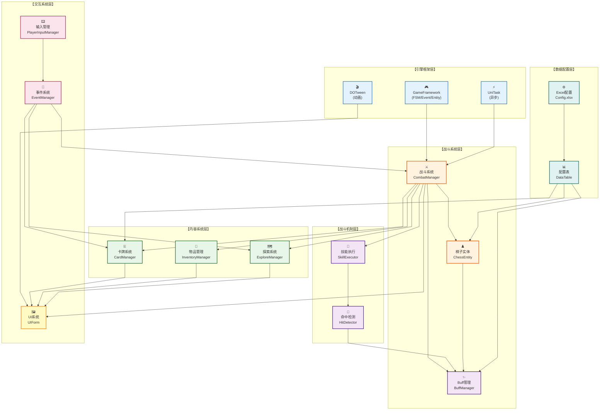
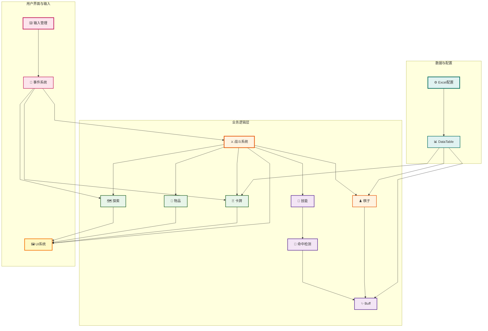

# 项目架构图 - 正交线条优化版

## 核心架构（正交线条设计）



---

## 简化版（三层结构 + 正交优化）



---

## 参数说明

### 正交线条优化参数

| 参数 | 值 | 作用 |
|------|-----|------|
| `nodeSpacing` | 150-180 | 增大节点间距，线条更直 |
| `rankSpacing` | 130-150 | 增大层级距离，减少斜线 |
| `curve` | linear | 直线连接，**关键参数** |
| `direction` | TB (自上而下) | 帮助对齐 |
| `diagramMarginX/Y` | 80-100 | 增加边距，给线条空间 |

### 提示

- ✅ `curve: linear` 是实现正交线条的关键
- ✅ 增大 `nodeSpacing` 和 `rankSpacing` 帮助线条避免重叠
- ✅ 使用 subgraph 分组可以帮助同层节点对齐
- ⚠️ Mermaid 的布局算法不能保证 100% 正交，但这个配置已经很接近

---

## 方案 B：使用 Graphviz（完美正交线条）

如果上面的 Mermaid 版本还不够整齐，可以用 Graphviz 获得**完美的 90° 正交线条**。

### 使用 Graphviz 在线渲染

1. **访问在线服务**：https://edotor.net/ 或 https://dreampuf.github.io/GraphvizOnline/

2. **复制以下代码到编辑器**：
```
详见：项目架构图-正交线条版.dot 文件
```

3. **自动渲染**，下载为 PNG/SVG

### 或者本地安装 Graphviz（Windows）

```bash
# 使用 Chocolatey
choco install graphviz

# 或下载安装：https://graphviz.org/download/
```

安装后运行：
```bash
dot -Tpng 项目架构图-正交线条版.dot -o 架构图.png
```

---

**推荐：** 用上面的 **Mermaid 版本**（方案A）就可以满足论文需求。如果需要完美的正交线条，用 **Graphviz + 在线编辑器**（方案B）。

哪个方案更适合你？
