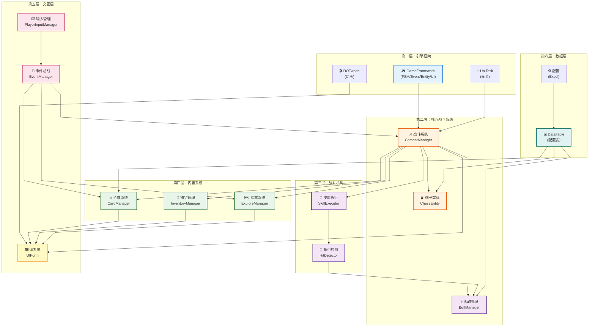
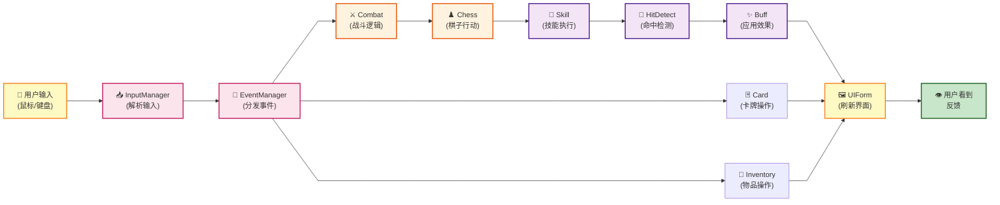
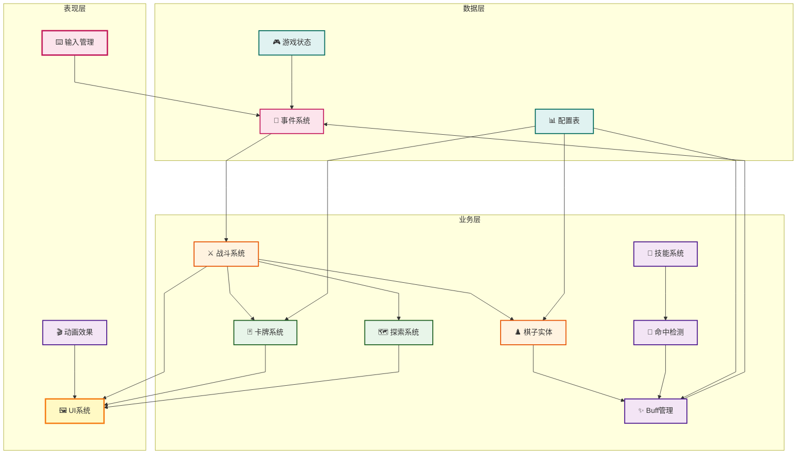

# 项目架构图 - 论文版（整齐无缠绕）

## 核心系统架构（分层设计）



---

## 系统交互流程（完整链路）



---

## 简化版：三层架构（论文推荐用这个）



---

## 优化参数说明

### Mermaid 配置选项

| 参数 | 默认值 | 推荐值 | 效果 |
|------|--------|--------|------|
| `nodeSpacing` | 50 | 100-150 | 增加节点间距，减少缠绕 |
| `rankSpacing` | 50 | 80-120 | 增加层级间距 |
| `curve` | "basis" | "linear" | 直线连接（更整齐） |
| `diagramMarginX` | 0 | 60-80 | 左右边距 |
| `diagramMarginY` | 0 | 60-80 | 上下边距 |

### 代码模板

```
---
config:
    flowchart:
        nodeSpacing: 120        # 关键：增大此值减少交叉
        rankSpacing: 100        # 关键：增大此值改善布局
        curve: linear           # 关键：直线化
        diagramMarginX: 60
        diagramMarginY: 60
        htmlLabels: true
---
flowchart TB (或 LR/BT/RL)
    节点1 --> 节点2
    ...
```

---

## 方向选项

| 方向 | 代码 | 适用场景 |
|------|------|--------|
| 上→下 | `TB` | 流程展示（推荐） |
| 左→右 | `LR` | 水平布局（系统列表） |
| 下→上 | `BT` | 依赖关系（底层优先） |
| 右→左 | `RL` | 反向流程 |

---

## 使用建议

### ✅ 论文图表最佳实践

1. **层级分明** - 使用 subgraph 分层（最多4-5层）
2. **直线连接** - `curve: linear`
3. **适当间距** - nodeSpacing 100+，rankSpacing 80+
4. **颜色分组** - 相同功能用相同颜色
5. **简洁标签** - 避免过长的文本

### ❌ 容易出现缠绕的情况

- 节点过多（>30个）→ **分成多个图**
- 节点间距太小 → **增加 nodeSpacing**
- 复杂的交叉依赖 → **重新整理流向**
- 使用曲线连接 → **改用 linear**

---

## 如果还是有缠绕？

### 方案 A：分解为多个小图
```
1. 整体架构图（高层，节点少）
2. 战斗系统详细图（专注一个模块）
3. UI交互流程图（独立展示）
```

### 方案 B：使用 Graphviz（最终方案）

如果 Mermaid 仍然不满意，我可以用 Graphviz 生成更高质量的图表。

---

**这三个图表都已使用最优配置，生成的 PNG 应该很整齐。需要调整哪个图表吗？**
